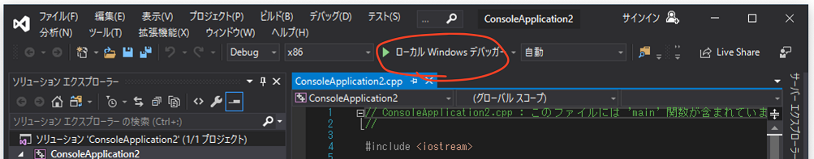
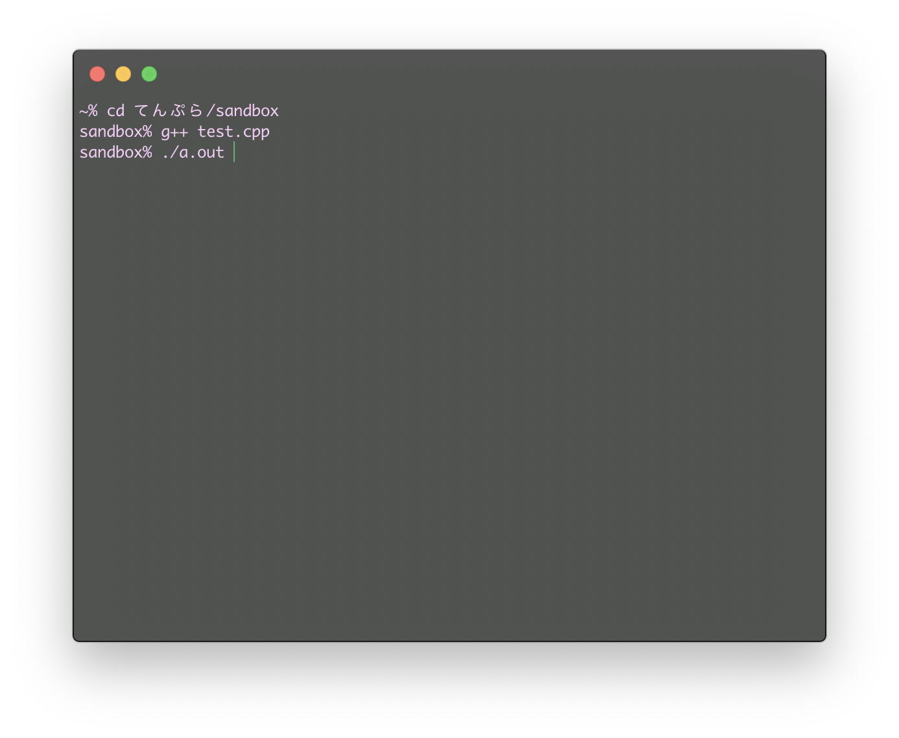

# 環境構築

何も用意してなかったら、何もできないよ


# 今回のゴール

* C/C++ について少し触れる
* C/C++ プログラムを書いて実行できる環境を作る

所要時間: 20 ~ 30 分くらい


# プログラムと実行形式

私達が普段触れている電子機器――スマホ、パソコン、ゲーム機――などには必ずアプリが関わっている。……いるよね？これ過去の人が読んでないよね？

そいつらはみんな、*「機械に何をさせるのか」っていうのを記述したもの* で作られている。これを **(コンピュータ) プログラム** という。

そして、プログラムを書くことを **プログラミング**、プログラムを書く人を *プログラマ* っていう。


## アプリはすべてプログラムによって作られている。

特に、生産的で一般的な手法として、 プログラミング言語 という独自言語のテキストを書くやり方がある。マウスだけで作るやつとかもあるけど、作ってるうちにテキストで書いたほうが楽なことに気づく。これマジ。

ここでは、そのプログラミング言語の中の一つの、それなりに強い言語 C++ を使ってく。ただ、これはまあまあレベルの高いこともできるけど、最初はこの言語の元になった C 言語と共通する部分しか触らないことにする。


## なぜ C++ なのか

* C 言語から派生した C 系言語は非常に多く、学習すると **それなりに広い分野で活かせる** から。
* 他の言語より、**実行速度が速い**。なぜなら、プログラムをマシンが実際に動かす符号 (機械語っていうけどこれについては詳しくないので勘弁) へと変換しているから。
* マシンに近いこともできて、逆に高度なこともできて、ゲームも作って、あまり目立たないけど大事なシステムも作って、**理論上はなんでもできる** から。(悪く言えば器用貧乏)
* 顔がでかくて、首が太くて、足が短くて、ちょっとずんぐりむっくりな感じする。(大嘘)


## C++ での作業の流れ

1. プログラムを書く。*コンパイル (下記)* する言語ではよく **(ソース) コード** と呼ばれる。別に味はしない。拡張子は cpp や cxx。ホントはなんでもいいけど。
2. **コンパイル** する。*コンパイラ* というアプリを使う。これにファイルを渡すと、プログラムから実行できるアプリを作る。有名なのは GNU C Compiler (`gcc`, `g++`) とか Clang (`clang`, `clang++`) とか Microsoft Visual C++ (`cl`) とか。
3. コンパイルされた実行形式 (Windows だと `.exe` とか) を動かす。


## C++ のインストール

### Windows の方

[ここから Visual Studio 2019 for Community をインストール](https://visualstudio.microsoft.com/ja/vs/community/) してね。

Visual Studio Installer で「C++ デスクトップ開発」を選択してインストールするのを忘れないように!

## macOS の方

[Mac App Store から Xcode をインストール](https://itunes.apple.com/us/app/xcode/id497799835) してね。

インストールできたら一回だけ起動してね。このときに必要なものがインストールされるから。

## その他特殊な OS の方

Debian 系なら `sudo apt-get install build-essential`

CentOS 系なら `yum install gcc`

それ以外は最初から入ってると思う。全部は網羅できないので勘弁してくださいφ(ﾟДﾟ )
……って、こういう OS 使ってる人たちは絶対インストール方法知ってるでしょ。

## 自分が自由に使える PC を持っていない方

[Wandbox](https://wandbox.org) っていう *ウェブコンパイラ* がおすすめ。

左上のメニューからコンパイラを切り替えられる。C++ なら `gcc` と `clang` と `zapcc` が使える。ちなみに C++ 以外の言語にも対応している。

実行 (Run) すると、下の黒い画面の上に **Share ボタン** が出てくる。これを押すとその書いたコードを保存して、そのリンクを取得できる。このリンクの URL は `https://wandbox.org/permlink/~` になる。

便利だけど、そのうち自分の PC を持つべき。


※自由に使えるっていうのは、えっちな画像を保存しても問題がない状態のことだよ。


# Hello, World!

まずはインストールできているか確かめるよ。


## Windows で Visual Studio 2019 を使う人

Visual Studio 2019 を起動して、新しいプロジェクトの作成 > コンソールアプリ で *プロジェクト* を作成してね。

そしたら出てきた画面のツールバーの **再生マークのボタン** (Windows デバッガーとか書いているやつ) を押して実行。



すると 黒いコンソール画面 が出てきて Hello, World! って表示される (はず)。そうなっていなかったり詰まったりしたら Slack とかで質問して。


## それ以外の人

以下のプログラムをテキストエディタに コピペして、好きな名前で *保存して* ね。拡張子 (ファイルの後ろの `.txt` とか `.exe` とかのやつ) を `.cpp` にしておけば、名前は何でもいいよ。 

```cpp
#include <iostream>
int main()  {
  std::cout << "Hello World!\n";
}
```

保存したら、コンパイラにプログラムを渡すよ。

macOS だと アプリケーション > ユーティリティ > ターミナル (もしくは好きなターミナルアプリ)

ほかは各自シェル

を開いてね。

`cd フォルダ名` でプログラムがあるフォルダに移動してから、`g++ ファイル名` でコンパイルしてね。`a.out` って名前のファイルができるから、これをそのままタイプして実行!



ッターン! `Hello, World!` って表示される (はず)。

何かうまくいかなかったら Slack か口頭で **質問** して。なんかやばいから。


# まとめ

ちゃんと準備できた?できた?次章からプログラムを書いていくから、よろしくね!
